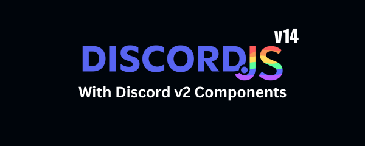
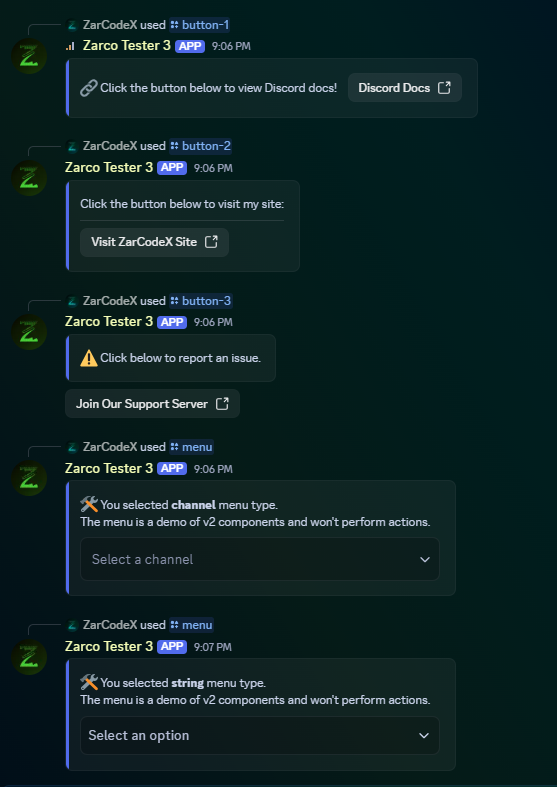
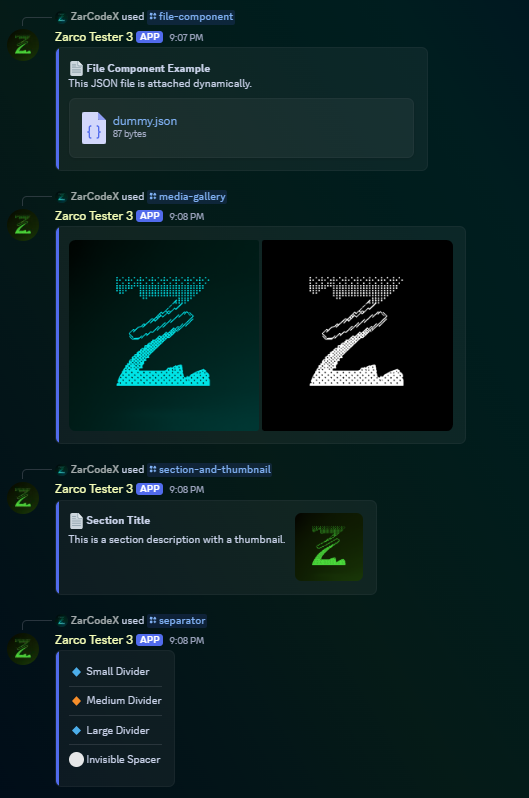
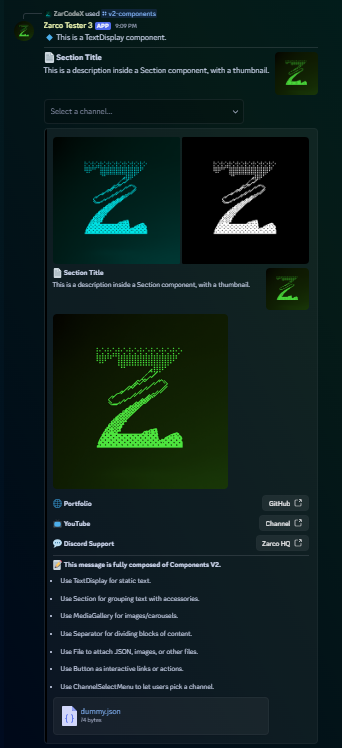

# Discord.js v14 with V2 Components Template

A full-featured Discord bot template built with **Discord.js v14** and the new **Components V2** system. This template demonstrates modern command and event handling, modular slash commands, media galleries, file components, and container-based layouts.

<p align="center">
  
</p>

## Make sure to leave a ⭐ if this helps :)

---
# Preview of V2 Components:

<p align="center">
<table>
  <tr>
    <td align="center">
      <br>Example 1
    </td>
    <td align="center">
      <br>Example 2
    </td>
  </tr>
  <tr>
    <td align="center">
      <br>Example 3
    </td>
    <td align="center">
      <br>Example 4
    </td>
  </tr>
</table>
</p>


---

## 📁 Project Structure

```

📦discord.js v14 with v2 components template
┣ 📂data                    # Optional data storage for bot usage
┣ 📂src
┃ ┣ 📂assets
┃ ┣ 📂config
┃ ┃ ┗ 📜config.json         # Bot configuration (color, emojis, etc.)
┃ ┣ 📂console
┃ ┃ ┗ 📜watermark.js        # Optional console watermark
┃ ┣ 📂events                # Event handlers
┃ ┃ ┣ 📂client
┃ ┃ ┃ ┣ 📜interactionCreate.js   # Interaction event handler
┃ ┃ ┃ ┗ 📜ready.js               # Ready event handler
┃ ┃ ┗ 📂Other               # Other custom events
┃ ┣ 📂handlers              # Handlers for events and slash commands
┃ ┃ ┣ 📜event.js
┃ ┃ ┗ 📜slash.js
┃ ┣ 📂slashCommands         # Slash command files organized by category
┃ ┃ ┣ 📂Info
┃ ┃ ┃ ┗ 📜ping.js
┃ ┃ ┗ 📂V2 Components
┃ ┃ ┃ ┣ 📜button-1.js
┃ ┃ ┃ ┣ 📜button-2.js
┃ ┃ ┃ ┣ 📜button-3.js
┃ ┃ ┃ ┣ 📜file-components.js
┃ ┃ ┃ ┣ 📜media-gallery.js
┃ ┃ ┃ ┣ 📜menu.js
┃ ┃ ┃ ┣ 📜section.js
┃ ┃ ┃ ┣ 📜separator.js
┃ ┃ ┃ ┣ 📜text-display.js
┃ ┃ ┃ ┗ 📜v2-components.js
┃ ┣ 📂temp                 # Temporary files (e.g., generated data)
┃ ┣ 📂utils                # Utility functions
┃ ┣ 📜index.js
┃ ┗ 📜zarco.js
┣ 📜.env                    # Environment variables (TOKEN, CLIENTID)
┗ 📜package.json

````

---

## ⚡ Features

- Modern **slash commands** with `SlashCommandBuilder`.
- Fully modular **event handler** with max listeners support.
- **V2 Components** support:
  - **TextDisplay** – display static text with Markdown.
  - **Section** – group text with thumbnails or buttons.
  - **Button** – clickable buttons (Primary, Secondary, Link, etc.).
  - **MediaGallery** – carousel of images/videos.
  - **FileBuilder / AttachmentBuilder** – send JSON or files.
  - **Separator** – divide content visually.
  - **ChannelSelectMenu** – select a channel interactively.
  - **ContainerBuilder** – aggregate multiple component types into a single layout.
- Automatic slash command registration.
- Dummy JSON generation for testing file components.
- Modular slash commands and events for easy scalability.
- **Sharding support** for large bots to distribute load across multiple processes.
- Console logs all loaded commands and events in a single box for clarity.

---

## ⚙ Installation

1. Clone the repository:

```bash
git clone https://github.com/ZarCodeX/discord.js-v14-v2-template.git
cd discord.js-v14-v2-template
````

2. Install dependencies:

```bash
npm install
```

3. Create a `.env` file in the root:

```env
TOKEN=YOUR_BOT_TOKEN
CLIENTID=YOUR_CLIENT_ID
```

4. Update `src/config/config.json` for colors, emojis, or other config values.

---

## 🚀 Running the Bot

Start the bot with:

```bash
npm start
```

You should see a consolidated console log with **all commands and events loaded**.

---

## 🧩 Adding Commands

1. Place command files under `src/slashCommands/[Category]/`.
2. Export using either `data` (SlashCommandBuilder) or `run` function.
3. Supported components for V2:

   * `text-display.js`
   * `section.js`
   * `button-1.js / button-2.js / button-3.js`
   * `file-components.js`
   * `media-gallery.js`
   * `menu.js`
   * `separator.js`
   * `v2-components.js` (example using all components)

---

## 📖 Guide for Components V2

* **TextDisplay** – static text messages.
* **Section** – text with accessories (Thumbnail, Buttons, Menus).
* **Button** – clickable interactive buttons.
* **MediaGallery** – carousel of images/videos.
* **FileBuilder / AttachmentBuilder** – attach JSON or images.
* **Separator** – add visual dividers or spacing.
* **ChannelSelectMenu** – interactive channel selection.
* **ContainerBuilder** – wraps multiple components into a single structured layout.

All of these components are included in separate commands as examples.

---

## 🔧 Customization

* Change **accent colors** in `config.json`.
* Replace **images** in `src/assets/` and update paths in commands.
* Add your own **buttons, menus, or media galleries** to create unique interactions.

---

## 📂 Folder Usage

* `src/assets` – local images, dummy JSONs, or other media.
* `src/temp` – for temporary files generated by commands.
* `src/utils` – helper functions for reuse.
* `src/handlers` – event and command handlers.

---

## 📝 Notes

* Ensure `MessageFlags.IsComponentsV2` is set when sending V2 components.
* Slash commands are automatically registered at app start.
* All console output for commands/events is consolidated in one box for readability.

---

## ⚖ License

MIT License – free to use and modify for personal or commercial projects.

---

## 📞 Support

Join the [Zarco HQ Discord](https://discord.gg/6YVmxA4Qsf) for help, updates, and discussion.
